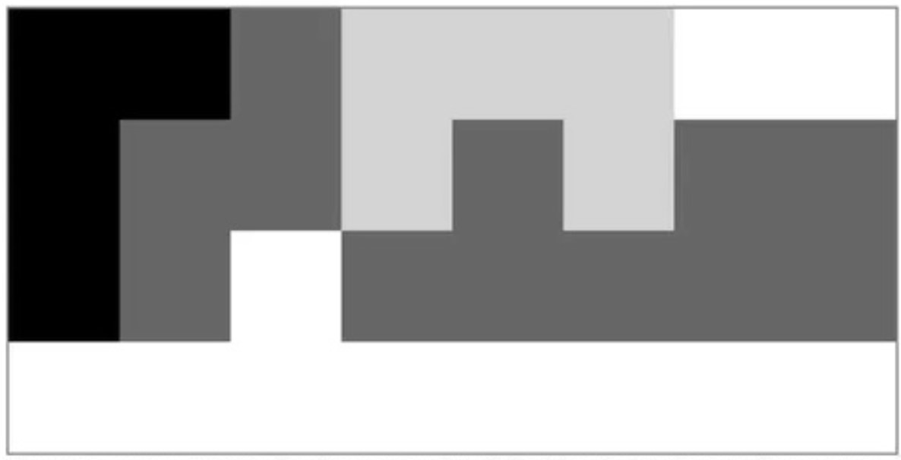

# Clusters

This tiny project is a training task for writing in C programming language,
which I received from my teammate at work to practice my coding skills.

## Files:

main.c clusters.c clusters.h

## Content of task:

Write a program that reads images in binary PBM (P4) or PGM (P5) format.
After loading the image, the program will count the clusters in individual shades
and print the number of clusters. A cluster is defined as a set of pixels
that are connected to each other by at least one side.



In the attached example, for an 8x4 pixel image there are 6 clusters
and the result of the program should be as follows:
```bash
color : size
    0 : 4
  102 : 4 8
  210 : 5
  255 : 2 9
```
At launch, the number of colors and clusters is unknown.
The program should use known data structures such as list, queue, stack.
The program cannot use recursion.

## Launch:

You can clone repo and easily adapt to your own needs.
Run by one command in bash terminal:
```bash
make
```
I worked on WSL2/Ubuntu environment and used gcc compiler with gnu99 C standard.
Good Luck.

## License

[MIT](https://choosealicense.com/licenses/mit/)